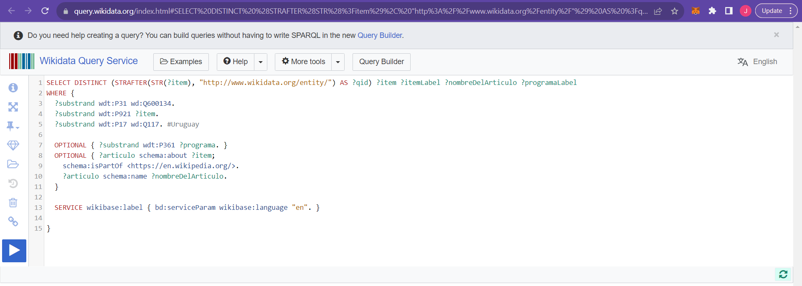

# wikicurricula-boilerplate
Interactive tool that helps visualize national curriculum data stored in Wikidata. It also shows metrics about Wikipedia articles that are relevant to the curriculum.
This is a boilerplate that will support the implementations in several countries and languages.

Credits to Wikipedia e Scuola Italiana for the original implementation.
Idea and leadership: Iolanda pensa
Web design and visualisation by Giovani Profeta - [repo](https://github.com/giovannipro/giovannipro.github.io/tree/master/wikipedia-scuola-italiana)
Work group: Federico Benvenuti, Valerio Iannucci, Luca Martinelli, Paolo Fichera
Support and collaboration: [Wikimedia Italia](https://www.wikimedia.it/)

## Make a Local Installation of the Wikicurricula Boilerplate on your Computer

- Go to the Wikicurricula Boilerplate GitHub repository
- Fork the repository
- Open up your terminal or command prompt
- Navigate to the directory where you want to store the project. 
- Run the following command to clone the repository to your computer: `git clone repository-url`
- Wait for it to clone the repository and when it is done, you'll see wikicurricula bolierplate folders on your system.

## Start Contributing

- Do a `cd wikicurricula-boilerplate` to navigate to the boilerplate on your terminal
- To contribute to the project or work on any task, you'll need to create a new branch. Use the `git checkout -b branch-name` command to create and switch to the newly created branch. Replace 'branch-name' with the name of your branch.
- Now you'll need to open up the local instance of the visualization on your web browser. To do this, open the index.html located in the 'visualization' folder of the project in your IDE, right-click on any part of the interface, and choose the 'Open in Default Browser' option or the 'Open with Live Server' option. This will open up the visualization in your web browser and will display a page like this:
 
- To open up the other visualizations in your web browser, go to the folder titled 'autori' and locate the index.html file and use the above step to view it in your web browser. Do the same for the 'avvisi' folder.
- After working on any task and you're ready to send it in for review, do a `git add .`.
- Next, run the `git commit -m 'commit message"` to commit the changes.
- Push the changes from your branch by using the `git push -u origin branch-name` command.
- Now if you go to your forked repo on your GitHub, you'll see the branch that was pushed with the changes you worked on.
- Click the "Compare and pull request" button. The next page that opens up, click on the "Create pull request" button.
- Now you've succesfully created a pull request. 
- The project maintainers will review your work and merge it to the main branch of the project repo if it's satisfactory or give you feedback where necessary.

# Documentation on how to feed the visualization with data from a new curriculum

This is a detailed step-by-step guide on how to feed the visualization with data from a new curriculum.
Before going into that, you'll need to learn how to build and run the Wikidata query.

## Building and running the Ghana curriculum wikidata query

- Obtain the wikidata query. This has already been provided [here](https://w.wiki/7Zge).

- When it opens up, you'll see a page as shown in the image below:
 
 This wikidata curriculum provides the SPARQL to extract structured data and the Wikidata Query needed to retrieve the specific curriculum data has already been provided. Now, you'll need to execute the query.

- To execute the query, click on the 'run' button/icon on the left-hand sidebar of the page. This will retrieve and display the curriculum data in tabular format at the bottom of the page, like so:
 
 NB: Tabular format is the default format for displaying the data but it can also be displayed in other formats like Graph builder, Line chart, Bar chart, Area chart, tree map, and so on. To change the display form, click on the "Table" dropdown located at the header of the terminal the data is being displayed in. Select the format you want it displayed in.

- After executing the query and retriveing the data, you can download or export the results in vaious formats like JSON, CSV, TSV, or HTML. Click on the "Download" dropdown located at the header of the table format where the curriculum data is being displayed. Select the "CSV file" option and wait for it to download.

- Rename it if you must and then import it into the 'data-gathering' folder of wikicurricula-boilerplate project in your editor.

## Feeding the Visualization with Data from the New Curriculum

